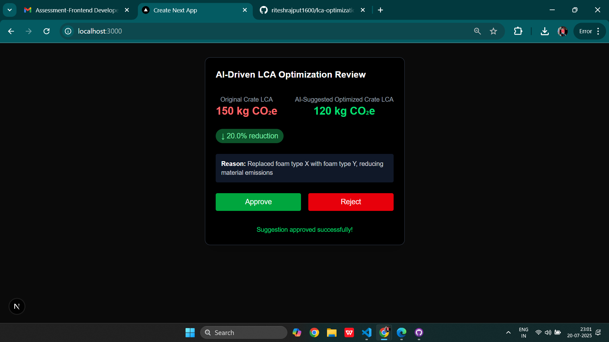

# LCA Optimization Review UI

This project is a simplified React/Next.js UI for reviewing AI-driven Life Cycle Assessment (LCA) optimization suggestions. It allows engineers to view the original and AI-optimized LCA values for a crate, see the AI's reasoning, and approve or reject the suggestion. All data and API calls are simulated for demonstration purposes.

## Features

- **Displays** original and AI-suggested optimized LCA values.
- **Shows** the AI's optimization reason.
- **Visual indicator** of percentage reduction.
- **Approve/Reject** buttons for user feedback.
- **Mock API integration** for data fetching and review submission.
- **Responsive design** using Tailwind CSS.
- **Success/Error messages** based on simulated API responses.

## Getting Started

### Prerequisites

- [Node.js](https://nodejs.org/) (v18 or newer recommended)
- [npm](https://www.npmjs.com/) or [yarn](https://yarnpkg.com/)
- [Next.js](https://nextjs.org/) project (this UI is designed for Next.js 13+ with the `/app` directory)

### Installation

1. **Clone the repository** (or copy the files into your Next.js project):

    ```sh
    git clone https://github.com/riteshrajput1600/lca-optimization.git
    cd lca-optimization
    ```

2. **Install dependencies** (if you haven't already):

    ```sh
    npm install
    # or
    yarn install
    ```

3. **Ensure Tailwind CSS is set up** in your Next.js project.  
   If not, follow the [Tailwind CSS Next.js installation guide](https://tailwindcss.com/docs/guides/nextjs).

4. **Project Structure**:

    ```
    src/
      app/
        LCAOptimization.jsx      # Main UI component
        lcaApi.js                # Mock API functions
    ```

### Running the Project

1. **Start the development server**:

    ```sh
    npm run dev
    # or
    yarn dev
    ```

2. **Open your browser** and navigate to [http://localhost:3000](http://localhost:3000).

3. **Access the UI**  
   Import and use the `LCAOptimization` component in your desired page (e.g., `src/app/page.jsx`):

    ```jsx
    import LCAOptimization from "./LCAOptimization";

    export default function Page() {
      return <LCAOptimization />;
    }
    ```

### How It Works

- **Data Fetching:**  
  The UI fetches mock LCA data using `fetchLCAData()` from `lcaApi.js` (simulated with `setTimeout`).

- **User Actions:**  
  When you click "Approve" or "Reject", the UI calls `submitReviewDecision()` (also simulated).  
  Success or error messages are displayed based on a random outcome.

- **Styling:**  
  All styling uses Tailwind CSS classes for a modern, responsive look.

## Customization

- **Change mock data:**  
  Edit `src/app/lcaApi.js` to modify the LCA values or optimization reason.
- **Integrate real APIs:**  
  Replace the mock functions with real API calls as needed.

## Troubleshooting

- If you see a React hook error, ensure `"use client"` is at the top of your component file.
- Make sure Tailwind CSS is properly configured in your project.

## License

No License. This project is for demonstration and educational purposes.


SnapShots


